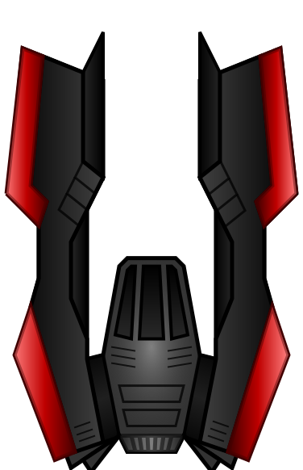
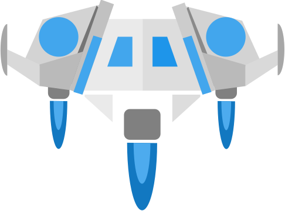
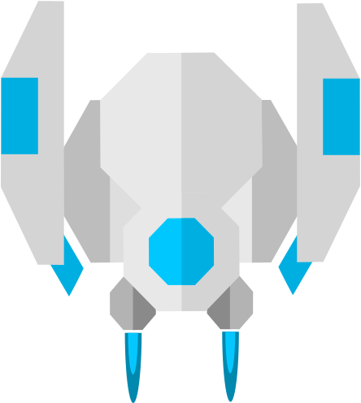
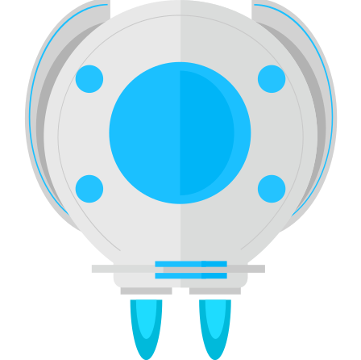
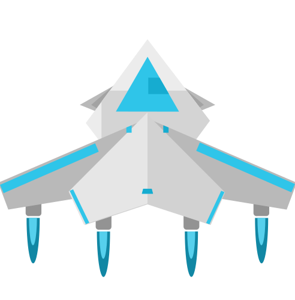
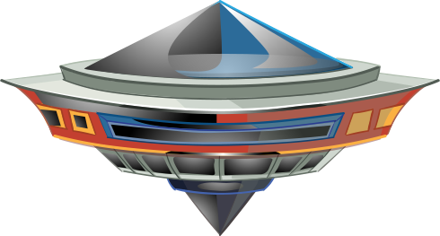
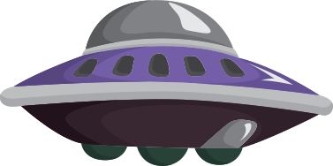
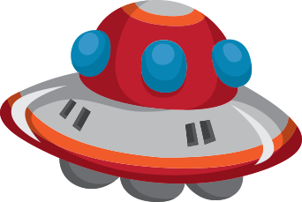

# Images

This folder contains images you can use for your game.

- [Images](#images)
  - [Spaceships](#spaceships)
  - [Background](#background)

## Spaceships

Here are some spaceship glyphs to choose from.

|  Space	| Ships 	|
|-	|-	|
|  |  |
|  |  |
|  |  |
|  |  |
|  |  |
|  |  |
|  |  |
|  |  |
|  |  |
|  |  |
|  |  |
|  |  |
|  |  |

## Background

Here is a background you can use:

